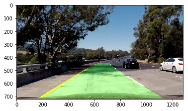

# **Advanced Lane Finding Project**

My project includes the following files:
* pipeline.ipynb - Jupyter notebook to process the original video (project_video.mp4)
* video.mp4 - output video with lane lines marked
* README.md - summarizing the results

The goals / steps of this project are the following:

* Compute the camera calibration matrix and distortion coefficients given a set of chessboard images.
* Apply a distortion correction to raw images.
* Use color transforms, gradients, etc., to create a thresholded binary image.
* Apply a perspective transform to rectify binary image ("birds-eye view").
* Detect lane pixels and fit to find the lane boundary.
* Determine the curvature of the lane and vehicle position with respect to center.
* Warp the detected lane boundaries back onto the original image.
* Output visual display of the lane boundaries and numerical estimation of lane curvature and vehicle position.

### Camera Calibration

The calibration is done in cell #2 of my IPython [notebook](./pipeline.ipynb). I used `cv2.findChessboardCorners` to find all the corners of the calibration [images](./camera_cal) and created lists of measured coordinates of chessboard corners in the image plane `imgpoints` and object points in real world space `objpoints`.

Here is an example of the corner detection. 
<a href="./camera_cal/corners_found1.jpg" target="_blank"></a>

### Distortion correction

With `imgpoints` and `objpoints`, the camera distortion can be corrected with `cv2.calibrateCamera()` (cell #3).


### Thresholded binary image

I used a combination of color and gradient thresholds to generate a binary image (cell #4).  Here's an example of the combined threshold image for test5.jpg (left). The gradient threshold component (_blue_) and the color channel threshold component (_green_) are shown in the right.


The code is similar to the one used in the lesson (section 30) that measures the gradient in x direction in the L channel (lightness) and sets a threshold in the S channel (saturation). I also include a cut in the hue space (H < 100) that seems to be useful picking the lane lines. 

### Perspective transform

The code for my perspective transform includes a function called `warper()`, which appears in lines 1 through 8 in the file `example.py` (output_images/examples/example.py) (or, for example, in the 3rd code cell of the IPython notebook).  The `warper()` function takes as inputs an image (`img`), as well as source (`src`) and destination (`dst`) points.  I chose the hardcode the source and destination points in the following manner:

```python
src = np.float32(
    [[(img_size[0] / 2) - 55, img_size[1] / 2 + 100],
    [((img_size[0] / 6) - 10), img_size[1]],
    [(img_size[0] * 5 / 6) + 60, img_size[1]],
    [(img_size[0] / 2 + 55), img_size[1] / 2 + 100]])
dst = np.float32(
    [[(img_size[0] / 4), 0],
    [(img_size[0] / 4), img_size[1]],
    [(img_size[0] * 3 / 4), img_size[1]],
    [(img_size[0] * 3 / 4), 0]])
```

This resulted in the following source and destination points:

| Source        | Destination   | 
|:-------------:|:-------------:| 
| 585, 460      | 320, 0        | 
| 203, 720      | 320, 720      |
| 1127, 720     | 960, 720      |
| 695, 460      | 960, 0        |

I verified that my perspective transform was working as expected by drawing the `src` and `dst` points onto a test image and its warped counterpart to verify that the lines appear parallel in the warped image.


### Identify lane-line pixels and fit their positions with a polynomial

I used the method taught in the lesson to find lane-line pixels (cell #8) and fit those pixels with a 2nd order polynomial. An example of the lane-line pixels (_red_ and _blue_) and the fit (_yellow_) are shown below.


### Calculate the radius of curvature of the lane and the position of the vehicle with respect to the center of the lane

The radius of curvature can be derived from the coefficients of the polynomial, shown in cell #10. To convert the pixel-based value to the physical value, I assume the lane is 3.7m in width and 30m in length (roughly equal to the length of 6 cars). The car's position (middle of the image) relative to the center of the lane (estimated from the polynomial fits) is in cell #11.

### Warp the detected lane boundaries back onto the original image

The birds-eye view of the lane is transformed back to the normal view with `Minv` by `cv2.warpPerspective()` and overlaid on the original distortion corrected image in cell #12. An example of the result on test5.jpg is shown below.



### Pipeline to process the video


Here is the processed [video](./video.mp4)

