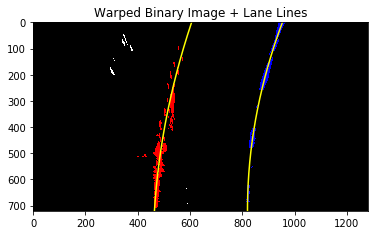

# **Advanced Lane Finding Project**

My project includes the following files:
* pipeline.ipynb - Jupyter notebook to process the original video (project_video.mp4)
* video.mp4 - output video with lane lines marked
* README.md - summarizing the results

The goals / steps of this project are the following:

* Compute the camera calibration matrix and distortion coefficients given a set of chessboard images.
* Apply a distortion correction to raw images.
* Use color transforms, gradients, etc., to create a thresholded binary image.
* Apply a perspective transform to rectify binary image ("birds-eye view").
* Detect lane pixels and fit to find the lane boundary.
* Determine the curvature of the lane and vehicle position with respect to center.
* Warp the detected lane boundaries back onto the original image.
* Output visual display of the lane boundaries and numerical estimation of lane curvature and vehicle position.

### Camera Calibration

The calibration is done in cell #2 of the [notebook](./pipeline.ipynb). I used `cv2.findChessboardCorners` to find all the corners of the calibration [images](./camera_cal) and created lists of measured coordinates of chessboard corners in the image plane `imgpoints` and object points in a plane (z=0) in real world space `objpoints`.

Here is an example of the corner detection. 

### Distortion correction

With `imgpoints` and `objpoints`, the camera distortion can be corrected with `cv2.calibrateCamera()` (cell #3).

### Thresholded binary image

I used a combination of color and gradient thresholds to generate a binary image (cell #4).  Here's an example of the combined threshold image for test_images/test5.jpg (left). The gradient threshold component (_blue_) and the color channel threshold component (_green_) are shown in the right.

The code is similar to the one used in the lesson (section 30) that measures the gradient in x direction in the L channel (lightness) and sets a threshold in the S channel (saturation). I also include a cut in the hue space (H < 100) that seems to be useful removing the shadow on the road.

### Perspective transform

Here I assume the road is flat and I'll map a straight lane line image (test_images/straight_lines1.jpg) into vertical lines. I chose 4 points `src` that form a trapezoid in the undistored source image and 4 points `dst` that form a rectangle in the transformed image (cell #5). The mapping `M` is carried out by `cv2.getPerspectiveTransform(src,dst)`.

Here is an example of transforming the image into a bird's eye view perspective. `src` and `dst` points are drawn by red lines.

Here is the warped thresholded binary image. The lane lines appear parallel. The binary image has applied region masking (cell #6) before changing into a bird's eye view perspective. Using a mask saves me a lot of troubles finding lane-line pixels next.

### Identify lane-line pixels and fit their positions with a polynomial

I used the method taught in the lesson to find lane-line pixels (cell #8) and fit those pixels with a 2nd order polynomial. An example of the lane-line pixels (_red_ and _blue_) and the fit (_yellow_) are shown below.

### Calculate the radius of curvature of the lane and the position of the vehicle with respect to the center of the lane

The radius of curvature can be derived from the coefficients of the polynomial, shown in cell #10. To convert the pixel-based value to the physical value, I assume the lane is 3.7m in width and 30m in length (roughly equal to the length of 6 cars). The car's position (middle of the image) relative to the center of the lane (estimated from the polynomial fits) is in cell #11.

### Warp the detected lane boundaries back onto the original image

The birds-eye view of the lane is transformed back to the normal view with `Minv` by `cv2.warpPerspective()` and overlaid on the original distortion corrected image in cell #12. An example of the result on test_images/test5.jpg is shown below.

### Pipeline to process the video

I combined all the steps above into a single function `process_image` (cell #15) and used `VideoFileClip` learned from [Project 1](https://github.com/enhsin/p1-laneLines) to process every frame in the video. A `Line()` class (cell #13) is used to store the polynomial fit of the previous frame and to keep track some other parameters. If the lane detection of the previous frame is successful, I'll select pixels that are within the margin of the lane line detected previously to determine the new fit (see section 33 of the lesson). I define a successful detection as the difference between the curvature of the left and the right lane is no greater than 90% (be order of magnitude similar). If the detection fails, it will use the lane line from the previous fit. 

The pipeline works well for most of the frame of the video, but fails to detect the left lane line around 21-23 seconds. Here is the image at 22.2 second. The lane line is quite faint. 

After lowering the lower threshold for the S channel from 170 to 80 from lots of trial and error, the left lane line can be detected well. The resulting video is [here](./video.mp4).

